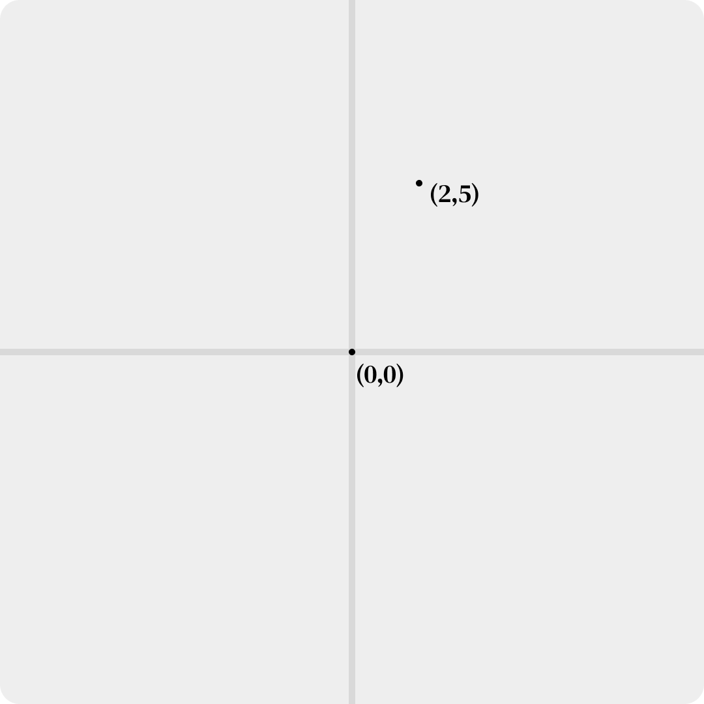
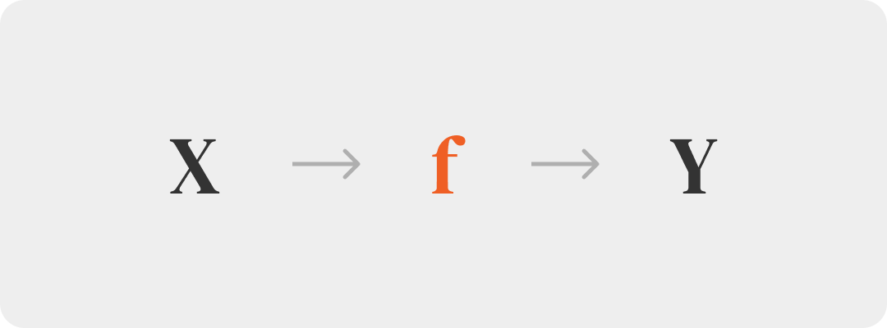
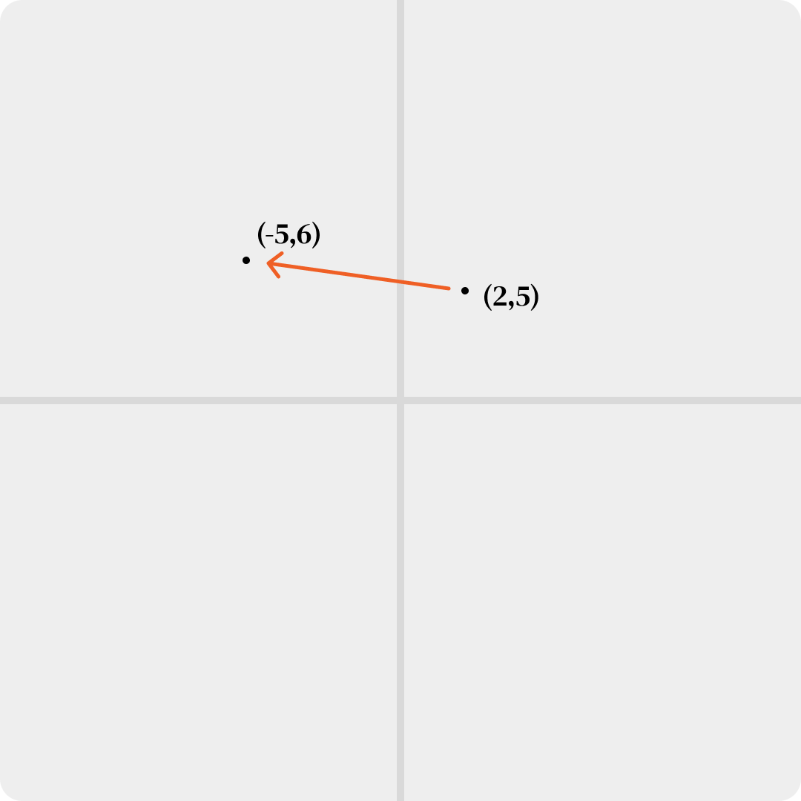
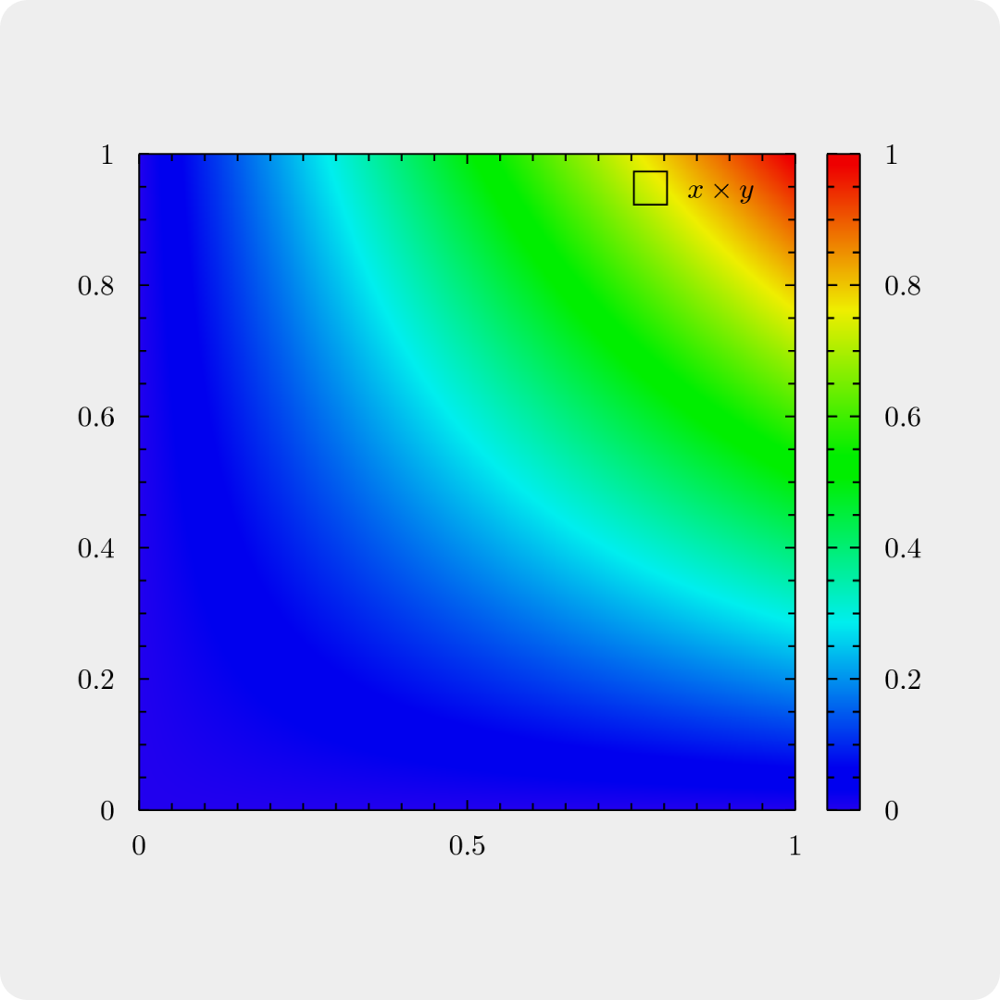
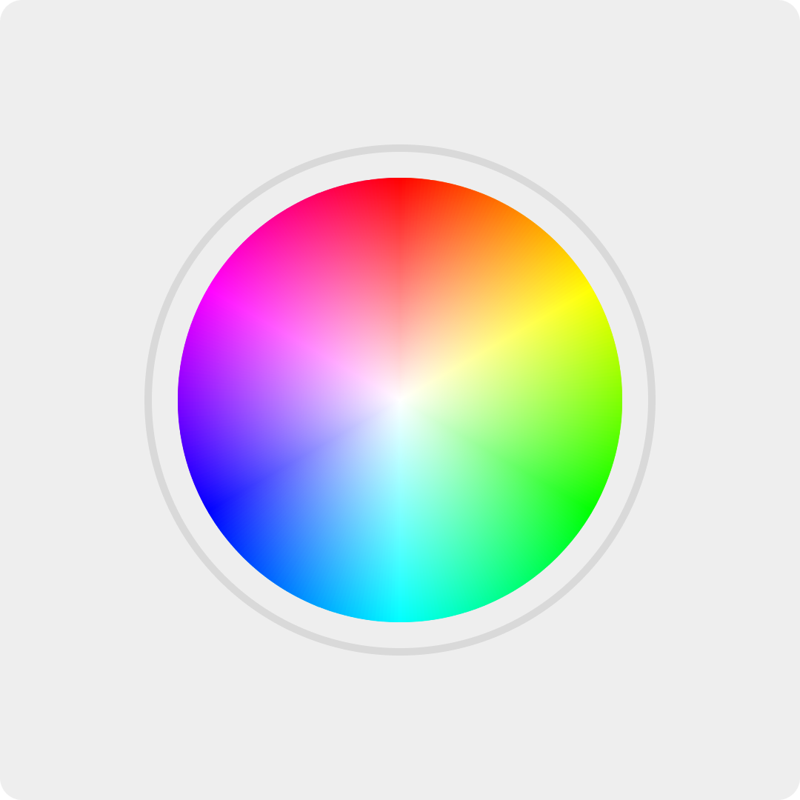
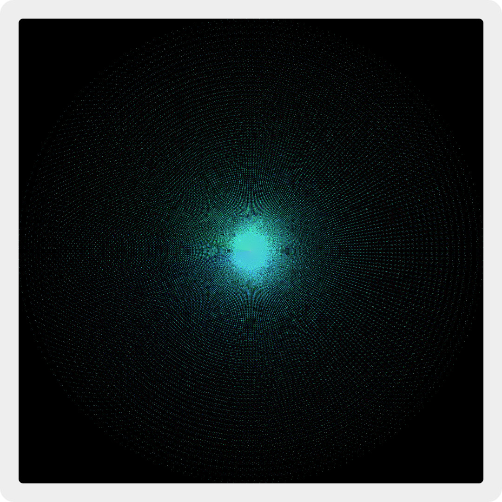
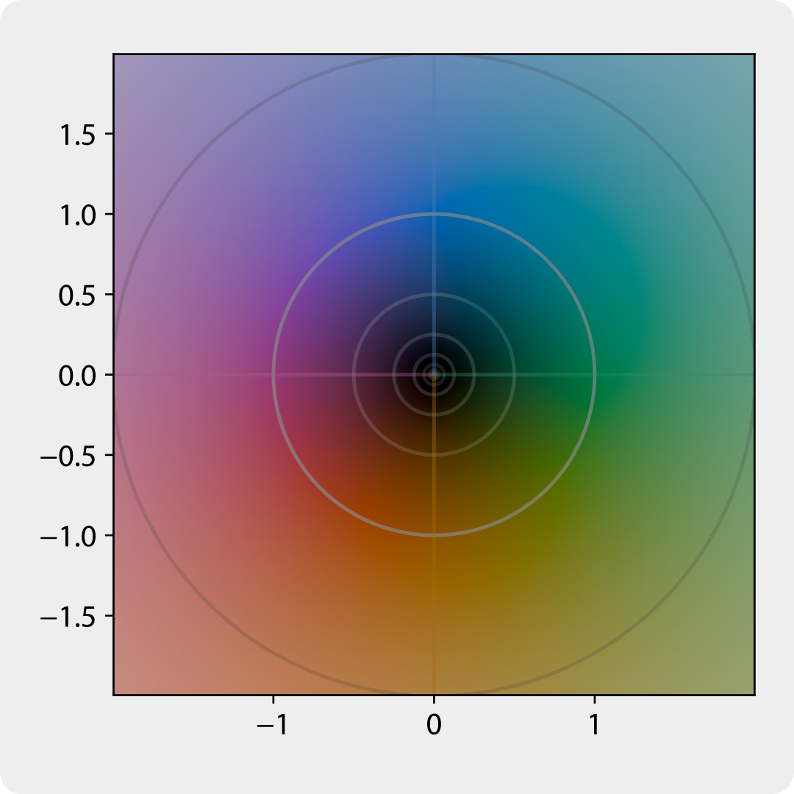

# 2D Complex Mapping by Utilizing Angular Colors

## 1. Complex Numbers

Complex numbers are two-dimensional mathematical entities that define the concept of √-1 as a new axis.

In the traditional number system, multiplying any two identical numbers always yields a positive result. To address this, we define iota (“i”) as a placeholder, which, when multiplied by itself, yields -1. This means iota = √-1 (it can also be -√-1, but for simplicity, we define this as -i). Using this concept, we can define numbers like 5i and 6i, which, when multiplied by themselves, produce negative results.

This placeholder cannot be placed on the current number line but can be represented as a new number line perpendicular to the traditional one. This provides us with a functional two-dimensional space to work with.

We now call the traditional number line the real axis and the placeholder the imaginary axis. The X-axis represents the real axis, while the Y-axis represents the imaginary axis.

Combining these two axes gives us the complex plane, where every coordinate corresponds to a number. For example, (2, 5) denotes 2 + 5i. These types of numbers, which have both a real part and an imaginary part, are called complex numbers. As we move right on the plane, the real part increases, while moving left decreases the real part. Similarly, moving up increases the imaginary part, and moving down decreases it. At the center of the view frame, we have (0, 0), representing 0 + 0i.

## 2. Complex Functions

Functions are computational tools that reveal intricate and beautiful patterns, even when defined by simple logic. A function acts like a computer: it takes an input, processes it, and provides an output. For example, the function f(n) = n×n takes an input n and outputs n×n. For instance, f(5) gives 5×5, which equals 25.

Now, consider applying this function to a complex number. What happens if we compute f(2 + 3i)? Here, we get (2 + 3i) × (2 + 3i). Simplifying, we find the result to be -5 + 12i, another complex number. A function that accepts a complex number as input and outputs a complex number is called a complex function.

Returning to the complex plane, we know that each number can be represented by a coordinate. This means we can form patterns using complex numbers. If we map each number from the input plane to the output plane, a pattern emerges. For example, one such mapping for a sample function could be:

    1 + 1i → 2 + 2i

    2 + 2i → 3 + 3i

    4 + 4i → 5 + 5i

However, mapping two axes to another two axes results in a four-dimensional representation. Since we cannot visually comprehend four-dimensional patterns, we need to explore an alternative way to represent such functions.

## 3. Color as a Dimension

Color is a visual representation of light, which is a combination of different wavelengths. The human eye perceives a wide range of colors, all of which can be represented as combinations of three primary (additive) colors: Red, Green, and Blue. These three colors can be combined in different proportions to create any color in the visible spectrum.

At first glance, it might seem logical to use RGB colors for mapping the plane. Input points could be represented as colors, and output points as coordinates. This approach, often called a heatmap, is widely used in various fields to visually represent complex data.

The issue with this model in our case is that RGB is a three-dimensional model, while we need a four-dimensional model to represent our complex functions. While using colors is indeed the solution, we must adapt them to represent four dimensions effectively.

## 4. Angular Colors

The color wheel is a circular representation of all colors, organized by hue. Hue refers to the type of color, such as red, blue, or green. The color wheel is divided into 360 degrees, with each degree corresponding to a different hue.

Hue alone provides only one additional dimension. To introduce another, we can use saturation, which measures the intensity of a color. A saturation of 0 results in white, while 100 represents the pure color. Saturation can represent the distance from the center of the color wheel: the closer to the center, the lower the saturation; the further, the higher the saturation. This model is called the HSL (Hue, Saturation, Value) color space. Value is usually kept constant (100 in our case), as it represents the darkness of the color.

Now we have two dimensions—hue and saturation—to represent either the input or output plane’s coordinates. The other two dimensions can be represented by yet another plane. Next, we must decide how to assign these dimensions.

Assuming that the domain is by default colored as the above picture, normalizing it's limits, we can assign each domain's coordinate color to a coordinate in output plane forming a mapping. This way, we can visualize the complex function's output in a 2D plane using angular colors. For example, given below is a limited mapping of popular riemann zeta function using our approach.

## 5. Goal

To implement this mapping, we need a script that:

1. Accepts a complex function as input.
2. Iterates over a set of coordinates from the input view frame.
3. Forms the default color mesh for the input plane.
4. Maps each color coordinate to the output plane using the complex function. All the remaining points in the codomain remain black.

## 6. Inspirations

The idea of this project draws inspiration from various mathematical and visualization techniques, notably domain coloring, where complex functions are represented by colors assigned to the input plane. However, this work distinguishes itself by focusing on the codomain, as opposed to the domain, which is traditionally emphasized. By prioritizing the codomain, this approach seeks to address the underexplored representation of output mappings in complex functions, making it a novel perspective in mathematical visualization.

While the use of colors in mathematical representations has been explored in various ways, such as in heatmaps and chromatic visualizations, the unique combination of angular color mapping and codomain focus sets this project apart. It provides a more comprehensive understanding of the complex outputs of mathematical functions while maintaining clarity and accessibility.
